# FDV_1.3


```
>>  PRACTICA:   Unity Project 1.3 Perforce
>>  COMPONENTE: XueMei Lin
>>  GITHUB:     https://github.com/XueMei-L/FDV_1.2.git
```

# Proceso de la practica 1.3
### 1. Crear una conexión al depósito FDV2425 en la ULL.

Instala [P4V](https://www.perforce.com/downloads/helix-visual-client-p4v) para establecer una conexion al servidor
**ssl:mudv-vcs.iaas.ull.es:1666**

realacionamos el espacio de trabajo FDV2425 
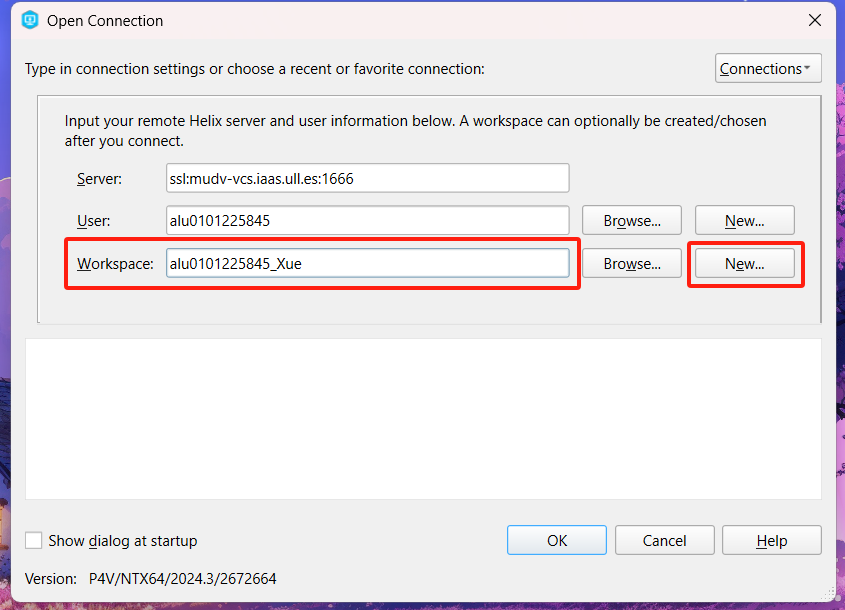
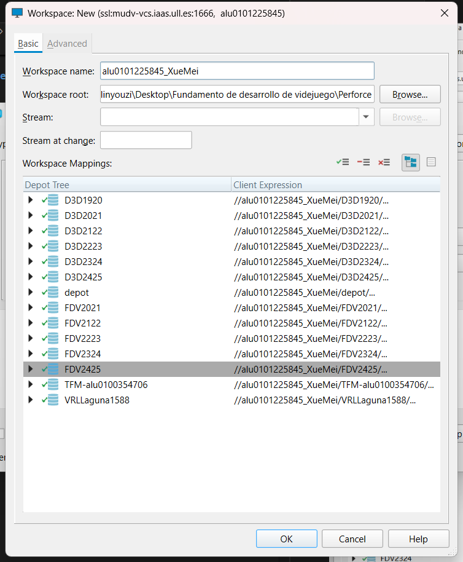

### 2. Clonar un repositorio

Una vez que creamos el espacio de trabajo, para clonar un repositorio solo hay que pinchar el repositorio que quemos, en en este caso es **FDV2425**, y pinchar **Get Latest**
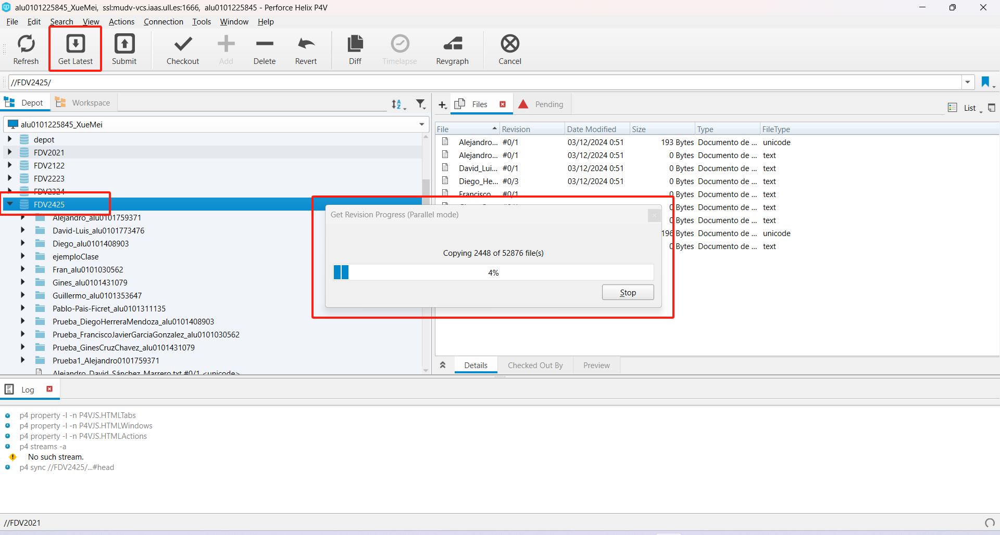
Así ya tiene el repositorio clonado.
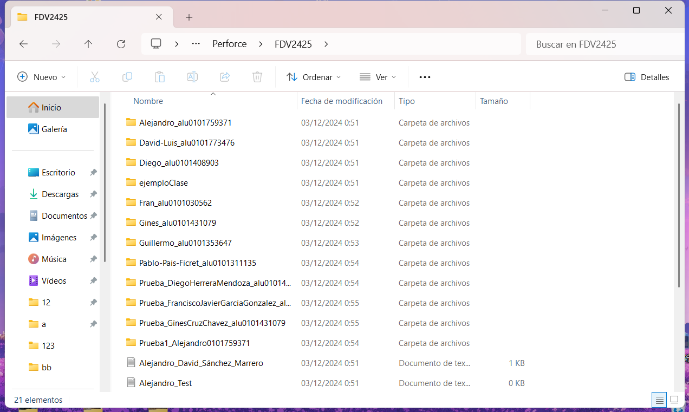

### 3.Modificar el fichero presentacion.txt, agregando una frase que indique tu nombre y resuma tu experiencia en el programación de videojuegos 2D y 3D.
Para modificar el fichero presentacion.txt hay que pinchar **checkout** primero, y luego añadir contenido.
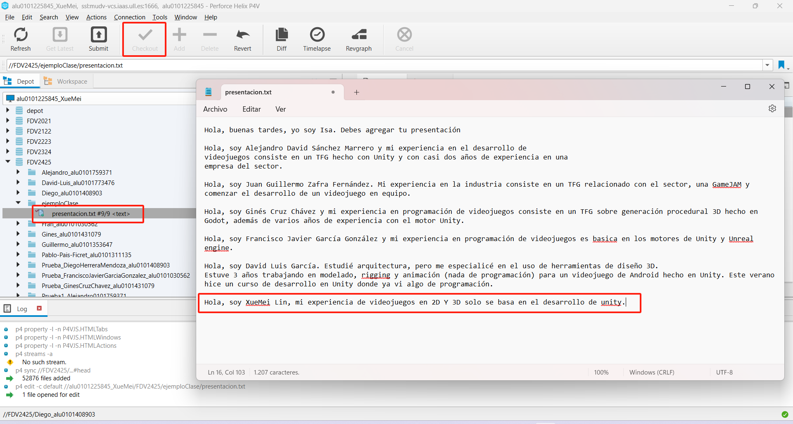
Después, hay que pinchar **submit** para subir

### 4. Crear un fichero nuevo, tu_nombre.txt y añádelo al proyecto.
Crear un fichero .txt en el local. En mi caso es **XueMei Lin. txt** para añadir al proyecto hay que ir a workspace encontrar el dicho fichero y pinchar **add** y **submit**
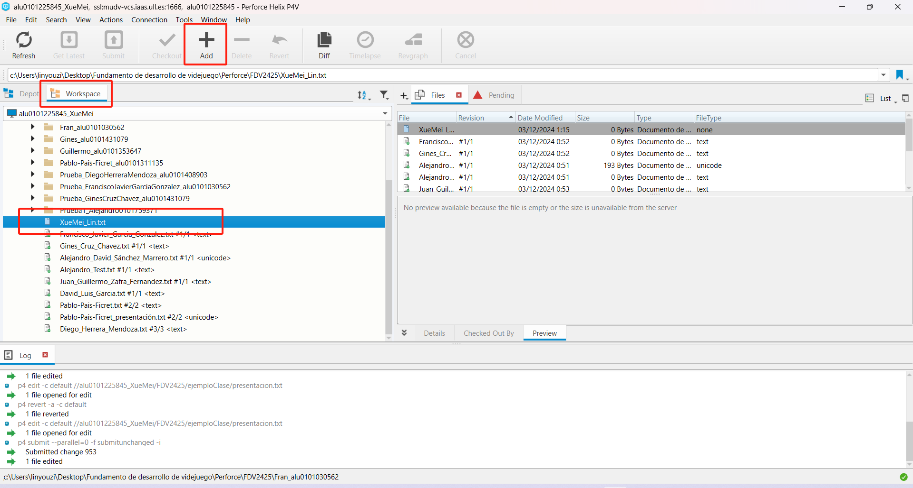
Así ya obtenemos el fichero subido.
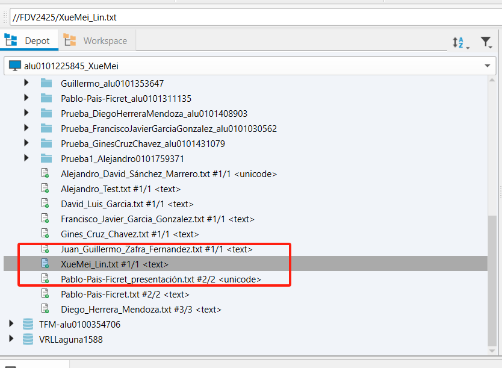


### 5.Crear un proyecto Unity 3D básico y agregarlo al depot de la asignatura. Tu nombre debe ser prefijo.
Creamos un proyecto unity 3D, y ponemos en el directorio de FDV2425, creamos el proyecto con cosas basicas, y volvemos a pinchar **workspace** para subir el proyecto entero.
!! Hay que hacer **gitFLS** y **.gitingore**
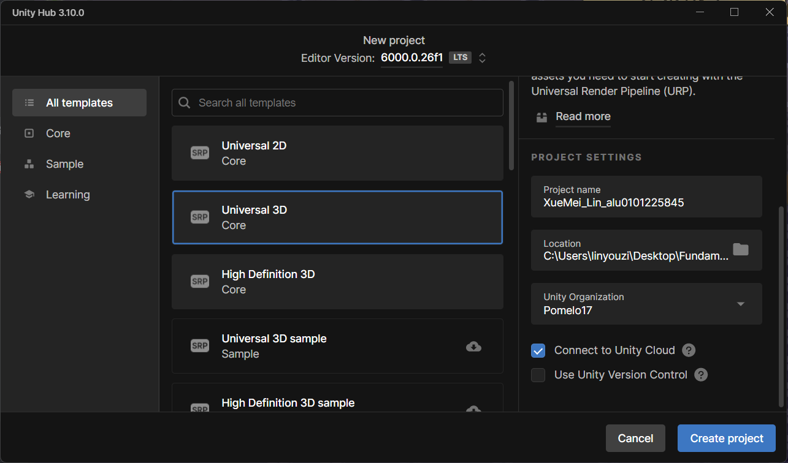
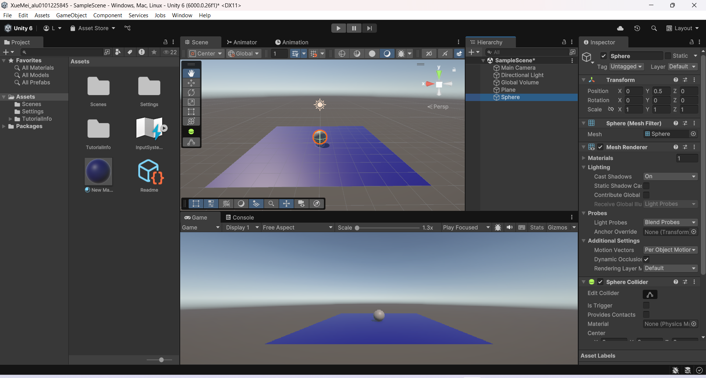
Para subir el proyecto entero, hay que hacer **gitFLS** y añadir **.p4ignore**, hacemos **add** y **submit**
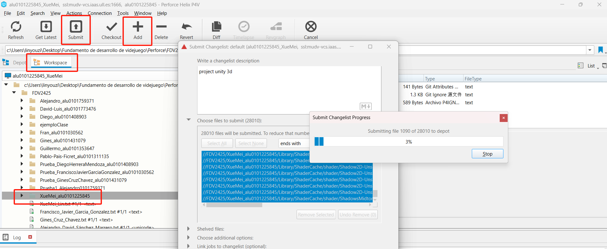
Resultado final
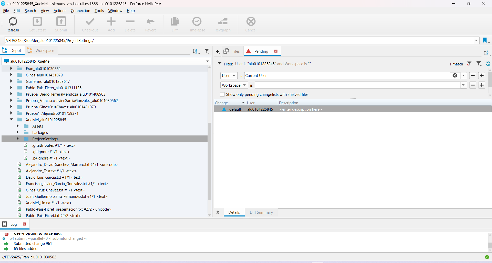
